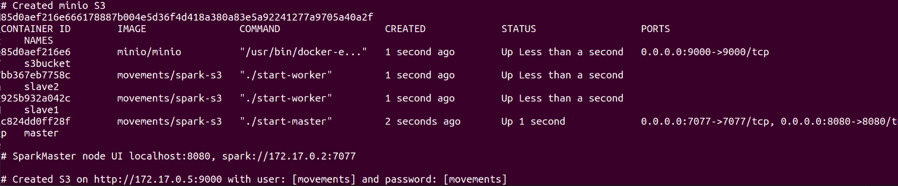
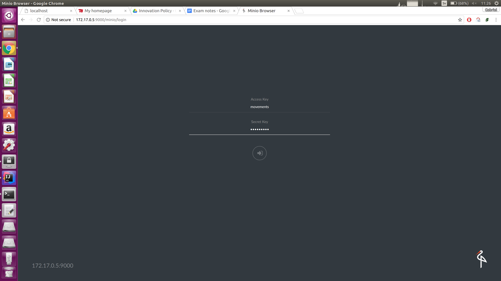
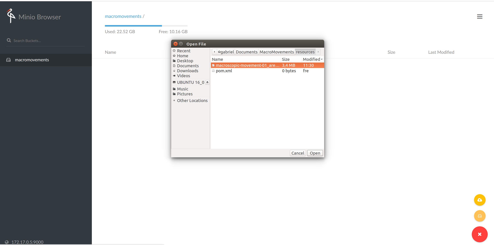
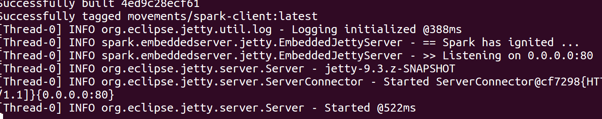
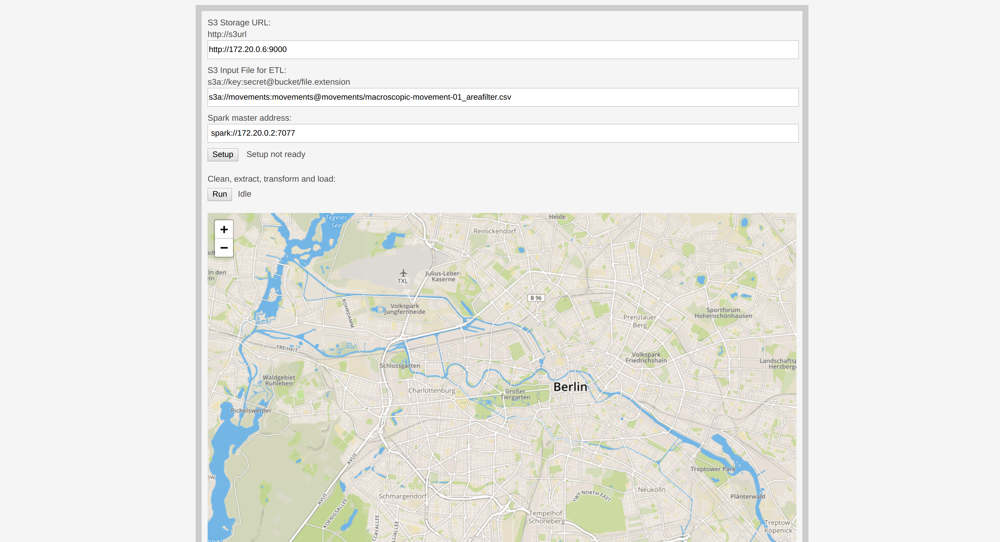

#### PROJECT STRUCTURE:

<pre>

   smashbox
   ├── jobs/                          
   │   ├── clustering.dbscan      : Modified implementation of Irving's DBScan on Spark
   │   ├── stopdetection          : Stop detection algorithm implementation on Spark
   │   └── movements.jobs         : Spark-submit compatible jobs                      
   │
   ├── server/	                                 
   │   ├── ServerMain.java        : Entry Point of the Web Server                            
   │   ├── utils	              : Utilities for web server               
   │   ├── resources              : HTML, Javascript and CSS files               
   │   ├── api	                   
   │   │    ├── ApiHandler.java	  : Api Interface		
   │   │    └── SparkClient.java  : Api Implementation for Spark-submit	
   │   ├── sparkjobserver	      : <Not Used> Created for low-latency jobs, but not used in the project	
   │   └── movements.docker       : <Not Used> Creating as proof of concept for spawning dockers to hadle spark-submit                
   │
   ├── prototypes                 : Prototypes for testing of spark-submit jobs 		        
   │
   ├── spark-s3/                  : Dockerfile for mocking Spark Cluster             
   │
   ├── documentation/                                  
   │   └── smashbox/utilities                  
   │
   ├── preparedockers.sh          : Script to spawn Minio S3 
   │                                and Spark Master/Workers dockers       
   │   
   ├── run.sh                     : Script used to build the docker 
   │                                containing jobs and server
   │
   ├── Dockerfile                 : Dockerfile used to build server and jobs mobule,
   │                                configure and deploy the docker
   └── README                                   
   
</pre>

### Overview

Project consists of three parts:

##### Stop Detection Algorithm

Stop Detection algorithm which given timestamp, latitude and longitude series is able
to determine which of detected points high be possible stay at the location.

##### DBSCAN on Spark

This is using an implementation of the [DBSCAN clustering algorithm](http://en.wikipedia.org/wiki/DBSCAN) 
on top of [Apache Spark](http://spark.apache.org/). It is loosely based on the paper from He, Yaobin, et al.
["MR-DBSCAN: a scalable MapReduce-based DBSCAN algorithm for heavily skewed data"](http://www.researchgate.net/profile/Yaobin_He/publication/260523383_MR-DBSCAN_a_scalable_MapReduce-based_DBSCAN_algorithm_for_heavily_skewed_data/links/0046353a1763ee2bdf000000.pdf). 

There is also a [visual guide](http://www.irvingc.com/visualizing-dbscan) that explains how the DBSCan algorithm works.

DBScan is used to cluster stops and detect most visited areas in which most of the locations been found

##### Graphx Graph Processing Engine

TODO:

### HOW TO RUN:

All project is dockerised, and the only requirement is Docker. Two scripts has to be executed:

1. `./preparedockers.sh` 

2. `./run.sh`

####1. Spawn dockerised Spark Cluster and Minio S3:

#####`./preparedockers.sh`  

This will output the spark ui url (`172.17.0.2:7077`) and s3 url (`172.17.0.5:9000`) with default user and password
(`movements`)

(If permission denied error appears, run `sudo chown -R $USER:USER .docker` on the docker file and rerun the script)

Now we can upload a file to s3 and execute the project on it. 
Access the outputted s3 url (`172.17.0.5`) and login with the username and password (`movments`)

To upload a file to s3, create a bucket and upload the input file to be processed.

####2. Build and run server docker containing all the jobs:

##### `./run.sh`

The server is now running.

Access the web interface (`localhost:9999`) and point the input file to the s3 and the spark from the preparedocker script.

Fill out the froms with s3 url, input file, and spark master adress. 

Then run 'setup' button followed by 'run' to run the job on the input file.

#### License

DBSCAN on Spark is available under the Apache 2.0 license. 
See the [LICENSE](LICENSE) file for details.

#### Credits

Stop Detection algorithm maintained by Piotr Mrowczynski, Gabriel Vilen and Ananya Chowdhury 
DBSCAN on Spark is maintained by Irving Cordova (irving@irvingc.com).

