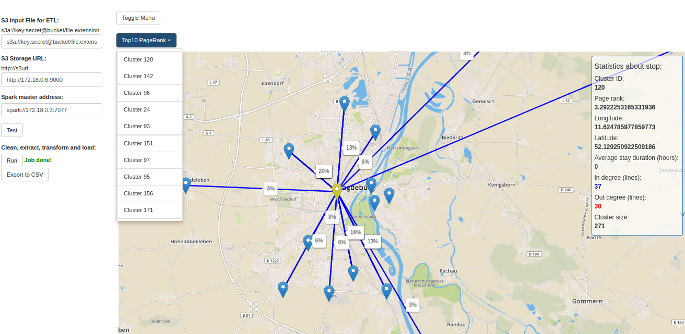
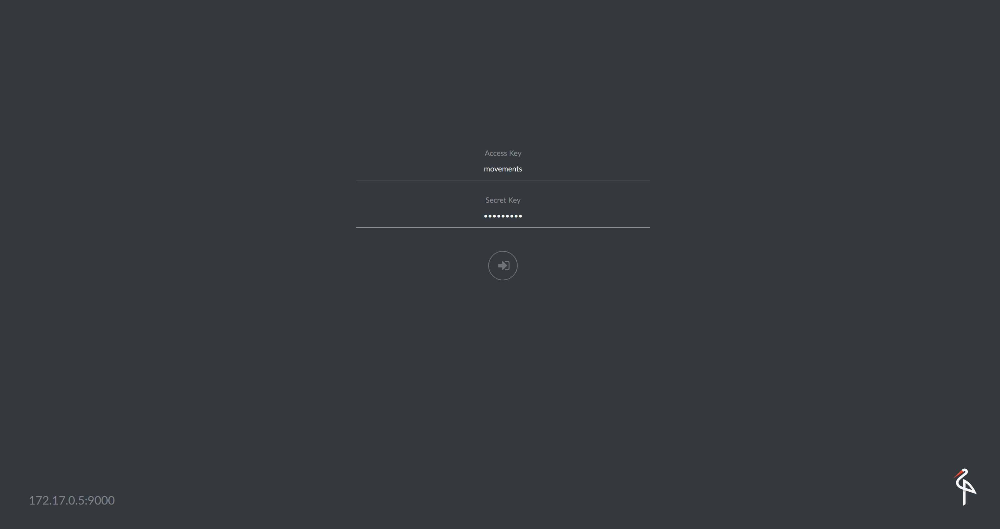

## Macroscopic movements
The idea behind this project is to provide 
algorithms and architectural software 
solution which will be able to process 
big amounts of data, visualize it and 
give macroscopic view on the collected 
data across multiple users. 
Particularly, we look at where the 
users stop and what are the significant 
places considering their movements in 
macroscopic city view. 



Work might be compatible with data 
sources as the one used in e.g. 
"Analysis of Berlin's taxi services by 
exploring GPS traces" research.

##### IMPORTANT sidenote - future work

Implementation hardcodes filtering all points outside Berlin area 
and sets Eps and MinPoints for areas within Berlin according to density
of population,
 DBSCAN implementation might need modification for 
 support of dynamic area - more info in documentation and in `jobs/src/main/scala/util/Config`

#### PROJECT STRUCTURE:

<pre>

   smashbox
   ├── jobs/                          
   │   ├── clustering.dbscan      : Modified implementation of Irving's DBScan on Spark
   │   ├── stopdetection          : Stop detection algorithm implementation on Spark
   │   ├── movements.jobs         : Spark-submit compatible jobs                     
   │   └── util/Config            : Sets parameters for the Spark jobs                      
   │
   ├── server/	                                 
   │   ├── ServerMain.java        : Entry Point of the Web Server                            
   │   ├── utils	              : Utilities for web server               
   │   ├── resources              : HTML, Javascript and CSS files               
   │   ├── api	                   
   │   │    ├── ApiHandler.java	  : Api Interface		
   │   │    └── SparkClient.java  : Api Implementation for Spark-submit	
   │   ├── sparkjobserver	      : <Not Used> Created for low-latency jobs, but not used in the project	
   │   └── movements.docker       : <Not Used> Creating as proof of concept for spawning dockers to hadle spark-submit                
   │
   ├── prototypes                 : Prototypes for testing of spark-submit jobs 	
   │   ├── data-analysis-python   : Visit data-analysis-python/README.md for more info
   │   └── graph-analysis-python  : Python scripts used for graph analysis        
   │
   ├── spark-s3/                  : Dockerfile for mocking Spark Cluster             
   │
   ├── documentation/                          
   │
   ├── preparedockers.sh          : Script to spawn Minio S3 
   │                                and Spark Master/Workers dockers       
   │   
   ├── run.sh                     : Script used to build the docker 
   │                                containing jobs and server
   │
   ├── Dockerfile                 : Dockerfile used to build server and jobs mobule,
   │                                configure and deploy the docker
   └── README                                   
   
</pre>

### Overview

The project primarily consists of three 
independent components; S3 storage, Apache Spark cluster, 
and the web server with spark jobs and spark-submit.


##### Inputfile format

```
dayofweek ; time     ; id     ; lat    ; lon
0         ; 04:27:10 ; userID ; 48.348 ; 8.606
```

##### Stop Detection Algorithm

Stop Detection algorithm which given timestamp, latitude and longitude series 
identifies points which are possible stops 

(for more info look in documentation)

##### DBSCAN on Spark

This is using an implementation of the [DBSCAN clustering algorithm](http://en.wikipedia.org/wiki/DBSCAN) 
on top of [Apache Spark](http://spark.apache.org/). It is loosely based on the paper from He, Yaobin, et al.
["MR-DBSCAN: a scalable MapReduce-based DBSCAN algorithm for heavily skewed data"](http://www.researchgate.net/profile/Yaobin_He/publication/260523383_MR-DBSCAN_a_scalable_MapReduce-based_DBSCAN_algorithm_for_heavily_skewed_data/links/0046353a1763ee2bdf000000.pdf). 

There is also a [visual guide](http://www.irvingc.com/visualizing-dbscan) that explains how the DBSCan algorithm works.

DBScan is used to cluster stops and detect most visited areas in which most of the locations been found
 
(for more info look in documentation)
##### Graphx Graph Processing Engine

Uses GraphX to compute PageRank, InDegrees, OutDegrees, NeighborsIn, NeighborsOut

(for more info look in documentation)

### HOW TO RUN:

As the project is build in conteneraised, the only requirement is Docker. Two scripts has to be executed:

1. `./preparedockers.sh` - will mock Spark and S3

2. `./run.sh` - will build docker image and run 
it using `docker run --name spark-client -p 9999:80 "movements/spark-client"`
internaly

####1. Spawn dockerised Spark Cluster and Minio S3:

#####`./preparedockers.sh`  


This will output the spark ui url (`172.17.0.2:7077`) and s3 url (`172.17.0.5:9000`) with default user and password
(`movements`)

(If permission denied error appears, run `sudo chown -R $USER:USER .docker` on the docker file and rerun the script)

Now we can upload a file to s3 and execute the project on it. 
Access the outputted s3 url (`172.17.0.5`) and login with the username and password (`movments`)


To upload a file to s3, create a bucket and upload the input file to be processed.


####2. Build and run server docker containing all the jobs:

##### `./run.sh`


The server is now running.

Access the web interface (`localhost:9999`) and point the input file to the s3 and the spark from the preparedocker script.

Fill out the froms with s3 url, input file, and spark master adress. 

Then run 'setup' button followed by 'run' to run the job on the input file.

#### Credits

Stop Detection algorithm, modified DBSCan and Graph creation maintained by Piotr Mrowczynski, Gabriel Vilen and Ananya Chowdhury 

DBSCAN on Spark is maintained by Irving Cordova (irving@irvingc.com).

